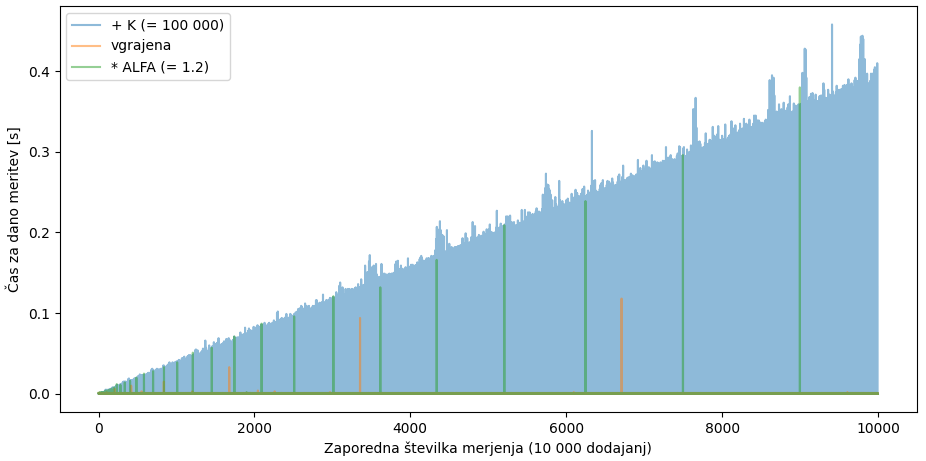
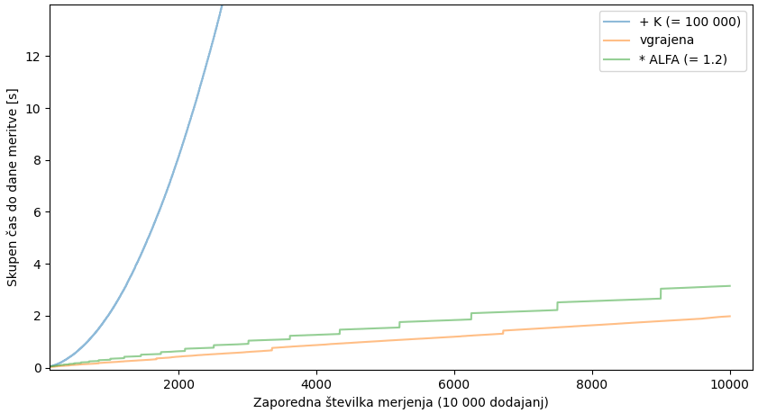

# Naloga

10 000-krat zapored smo v tabelo dodali skupino 10 000 elementov in za vsako skupino merili čas dodajanja.
Uporabili smo tri taktike povečevanja kapacitete tabele (v primeru, da postane polna):

- vgrajeno,
- tabelo podaljšamo za `K = 100 000`,
- tabelo podaljašamo z `velikost` na `velikost * alfa` (zaokroženo navzdol), kjer je `alfa = 1.2`.

# Rezultati

Najprej prikažemo posamične čase:



Vidimo, da je taktika `+K` daleč najslabša: zelo pogosto zelo dolgo traja, da dodamo 10 000 elementov.

Oglejmo si še kumulativne čase (torej čase od začetka do (vključno) i-te skupine):


Vgrajena in `* alfa` taktika sta si zelo podobni, taktika `+ K` pa precej slabša. Povečajmo torej spodnji del grafa:



_Očitno_ sta vgrajena in `* alfa` taktika enaki, a uporabljata različno vrednost parametra `alfa`: naša je (namerno) manjša,
kar se vidi po številu _"nezveznosti"_ v grafu.


# Struktura

Poskusili smo slediti _lepemu_ načinu implementacije:

1. Program poganjamo v `main.cpp`.
2. V `tabele.h` so le deklaracije.
3. V `tabele.cpp` so potrebne implemenetacije.

Ker je treba _skompajlati_ več kot le en `.cpp`, je v `.vscode/tasks.json` ukaz za _kompajler_ malo drugačen:

```
{
    "type": "cppbuild",
    "label": "C/C++: g++.exe build active file",
    "command": "C:\\msys64\\mingw64\\bin\\g++.exe",
    "args": [
        "-fdiagnostics-color=always",
        "-static-libstdc++",
        "-g",
        "${fileDirname}\\**.cpp",
        "-o",
        "${fileDirname}\\${fileBasenameNoExtension}.exe"
    ],
```

Poberemo torej vse dostopne `.cpp` datoteke in jih zapakiramo v `<ime trenutne>.exe` (poženemo na `main.cpp`, tj. ime trenutne `main`)


# Opombe

1. Več o [dedovanju](https://www.geeksforgeeks.org/inheritance-in-c/)
2. Več o [abstraktnih metodah](https://www.geeksforgeeks.org/pure-virtual-functions-and-abstract-classes/) (ang. _pure virtual_) 
3. Destruktorje (četudi abstraktne) je treba [**vedno implementirati**](https://stackoverflow.com/a/12574407/2281318).
