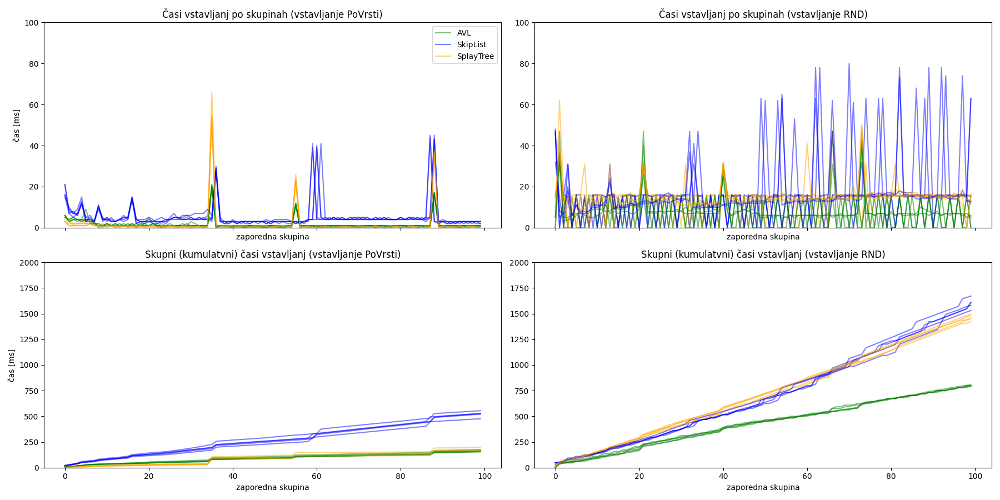
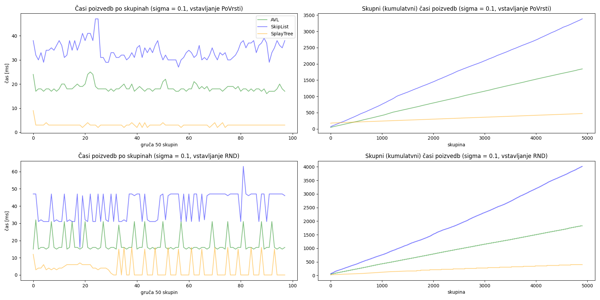
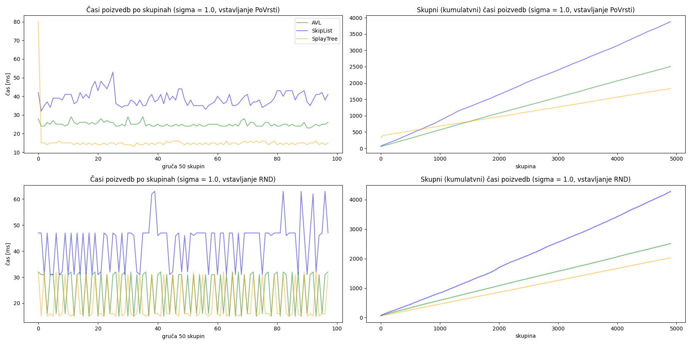
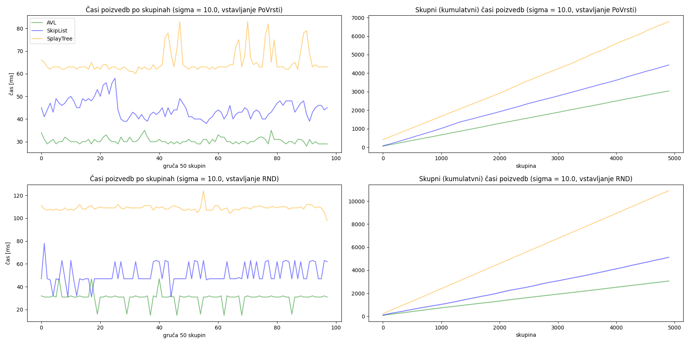
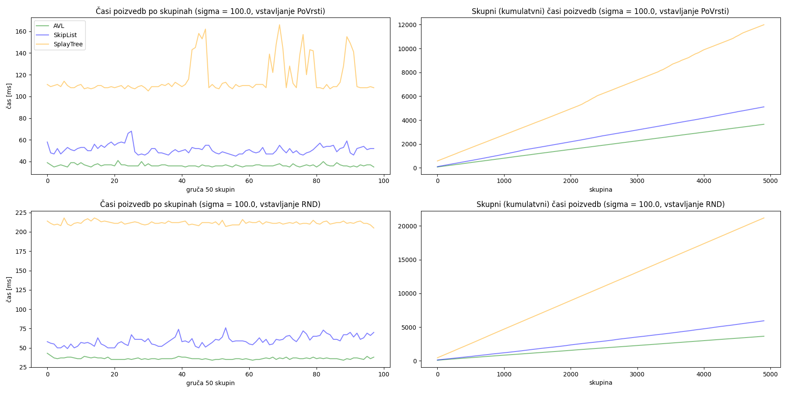
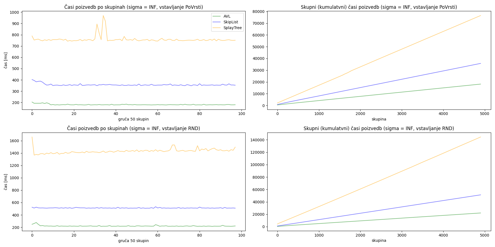

# Primerjava hitrosti raznih drevesnih struktur

Primerjajmo hitrost vstavljanja in dostopanja pri

- AVL-drevesih,
- lomljenih drevesih (ang. _splay tree_),
- preskočnih seznamih.

V drevo smo vstavili $n = 10^6$ elementov (števil $0$, $1$, ..., $n - 1$).
Merili smo čase 50 zaporednih vstavljanj oz. poizvedb.

## Načini vstavljanja

Elemente smo dodali bodisi v naključnem vrstnem redu bodisi povrsti.

## Načini poizvedovanja

Simulirali smo dostopanje do novic na portalu, ki so popularne zgolj nekaj časa.
Zato je vrstni red dostopov 1, 1, 2, 1, 2, 2, 3, 3, 3, ... bolj realen kot čisto naključen.

 Vrstni red dostopov smo dobili tako, da smo najprej dobili čase dostopov do novic: časi dostopov do novice $i$ so bili porazdeljeni normalno $\mathcal{N}(i,\sigma)$ (nismo se zapletali z morda še primernejšimi porazdelitvami). Obravnavali smo različne stopnje razpršenosti (in posledično število popularnih novic ob danem času):

$\sigma \in\{0.1, 1.0, 10, 100, \infty \}$

Vrednost $\sigma =\infty$ smo simulirali z enakomerno naključno porazdelitvijo na intervalu $[0, 1]$, saj nas zanima le vrstni red dostopov.

## Rezultati

Najprej si poglejmo čase vstavljanj, nato pa še poizvedb.

### Vstavljanja

Če elemente vstavljamo po vrsti (leva grafa), so AVL- in lomljena drevesa boljša od preskočnih seznamov.

Če jih vstavljamo v naključnem vrstnem redu (desna grafa), so AVL drevesa boljša od preostalih dveh struktur.

Na grafih je več kot ena črta za vsako strukturo, ker smo lenobno vsak poskus ponovili pri različnih vrednostih $\sigma$ (kar sicer na čase vstavljanj ne more vplivati).

### Poizvedb

Na čas poizvedb vplivata tako način vstavljanja (zaradi končne oblike strukture) kot tudi vrstni red poizvedb (pri lomljenih drevesih je to očitno, pri vseh strukturah pa računalniku tudi ustreza, da brskamo po podobnih kosih spomina).

Spodaj sledijo grafi za vse vrednosti $\sigma$. Na levi so časi "posameznih" poizvedb, na desni pa skupni časi. Ker so poizvedbe zelo hitre, na levih grafih prikažemo čas za
gručo 50 zaporednih skupin (ena skupina je 50 poizvedb, zato točka na grafu prikazuje čas za 2500 poizvedb).

Vidimo, da se lomljena drevesa odlično obnesejo pri majhnih vrednostih $\sigma$ (razen morda pri skupini poizvedbi), pri večjih vrednosti pa so spet najboljša AVL-drevesa.

